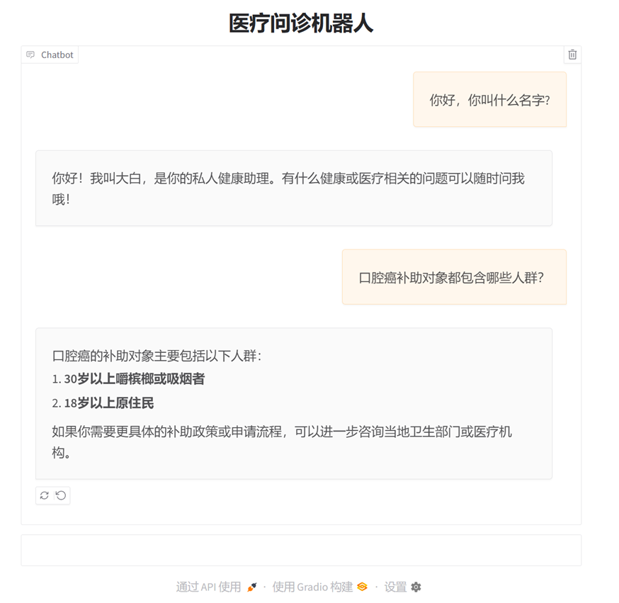
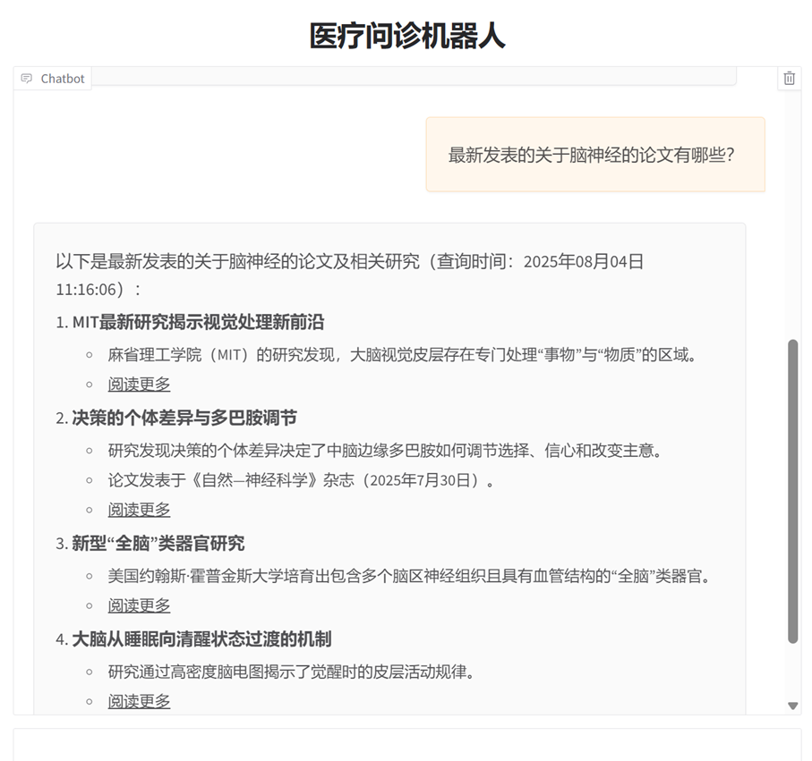
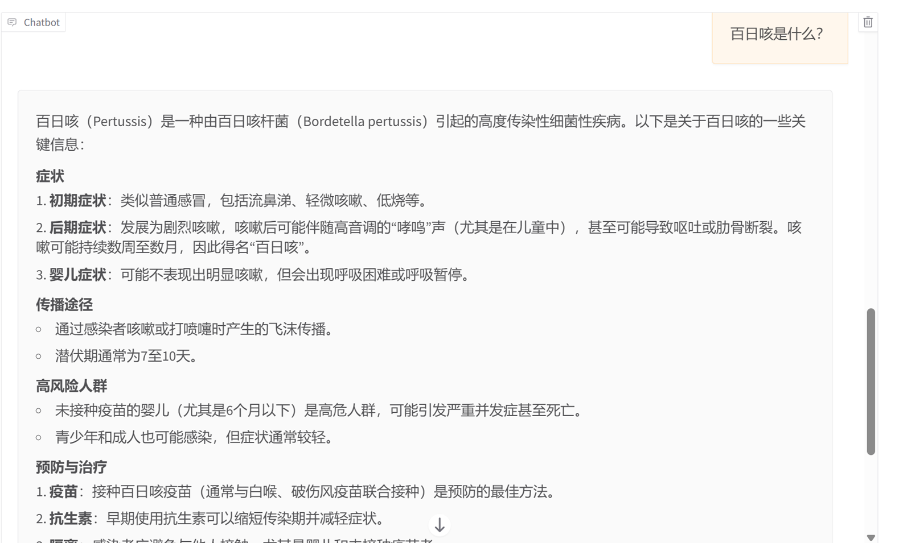
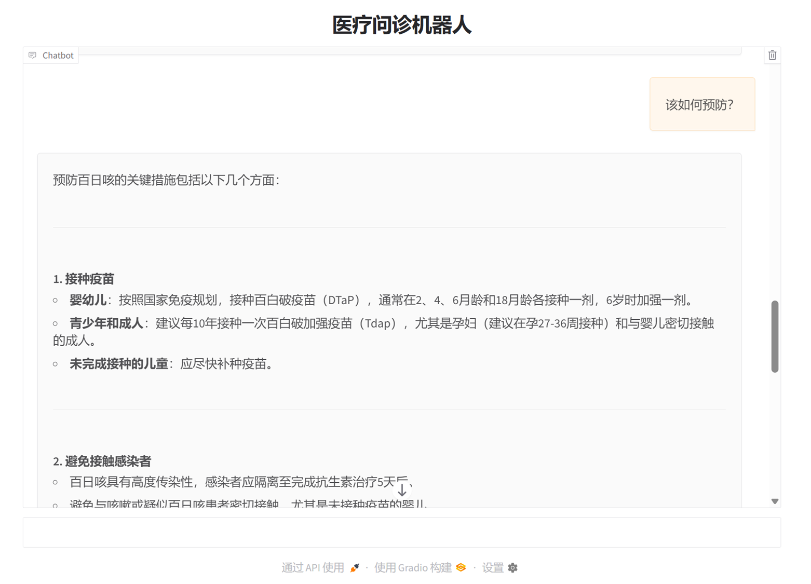

# 医疗问答系统
## 概述：

⚫ 基于垂直网站数据构建医疗知识图谱，实现非结构化文本数据处理，利用neo4j数据库存储知识图谱，同时基于all-mpnet-base-v2模型完成向量数据库构建；

⚫ 利用检索增强生成（RAG）增强模型生成能力：在向量数据库中检索相关信息，将检索结果融入DeepSeek的输入提示词，确保回答基于可信数据；

⚫ 通过实体识别获取用户关键字，使模型能够查询图数据库回答用户问题；

⚫ 通过DeepSeek模型构建Agent，定义业务所需的工具函数，根据对话历史确定用户需求，并自动选择合适工具实现相关功能；

⚫ 通过gradio实现交互界面构建，接受用户输入及呈现模型输出
## 效果展示
### 1.基本信息与增强检索生成

### 2.基于网络搜索内容回复

### 3. 记忆功能以及图数据库查询回复

参考资料：
https://www.bilibili.com/video/BV12hNue3EiE?spm_id_from=333.788.videopod.episodes&vd_source=0420ab403b090fdee51e16f358ee137a

https://github.com/liuhuanyong/QASystemOnMedicalKG

https://python.langchain.com/docs/introduction/